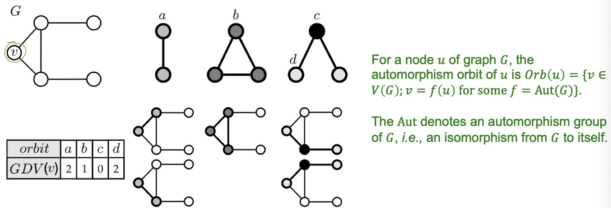
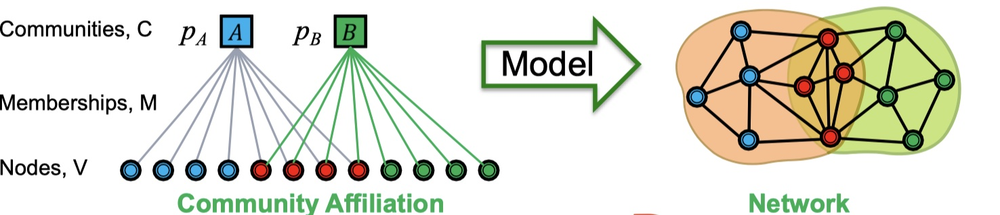

<!-- # Note for CS224W - Machine Learning with Graphs -->

---
layout: post
comments: true
title:  "Note for CS224W - Machine Learning with Graphs"
excerpt: ""
date:   2019-12-08
mathjax: true
---

> Some notes for the Machine Learning with Graphs class taught by Prof. Jure Leskovec at Stanford University in the Fall semester of 2019.

## Basics, Structure of Graphs

Some common tasks in analyzing networks: node classification, link prediction, community detection, network similarity, etc.

A graph $G(N, E)$ consists of a set of nodes $N$ and edges $E$ where edges might be *undirected* (undirected graph) or *directed* (directed graph). Sometimes a node may point to itself via *self-loop*, or point to another node via *multiple edges* (multigraph). Edges can be either *unweighted* (unweighted graph) or *weighted* (weighted graph)

*Node degree*, $k_i$, is the number of edges adjacent to node $i$. Nodes in a directed graph have *in-degrees* and *out-degrees*. We can also derive that:

$$\begin{aligned}
avg(k) &= \frac{1}{N} \sum_{i=1}^{N} k_i = \frac{2E}{N} \\
avg(k) &= \frac{E}{N} = avg(k^{in}) = avg(k^{out})
\end{aligned}$$

*Bipartite graph* is a special type of graphs whose nodes can be divided into two disjoint sets $U, V$ such that every edge connects a node in $U(V)$ to one in $V(U)$.

> An example is academic graphs where authors and papers are the two disjoint sets. Every edge (citation) connects an author to a paper.

By folding a bipartite graph, we can obtain a *folded graph* consisting of all nodes in one disjoint set of the bipartite graph. Two nodes are connected if they have a shared neighbor in the other disjoint set.

> A author-to-paper bipartite graph can be folded to a author-collaboration folded graph (nodes are authors) or a paper-co-authoring folded graph (nodes are papers).


### Representing graphs

There are three common ways of representing a graph: 

1. adjacency matrix
2. adjacency list
3. edge set

#### Adjacency matrix

Adjacency matrix $A$ is a $N \times N$ matrix where $N$ is the number of nodes and $A_{ij} = 1$ if there is an edge from $i$ to $j$ else $A_{ij} = 0$.

Some properties of adjacency matrix:

1. $A$ is symmetrical if $G$ is undirected.
2. The sum of row $i$ equals to $k_i$ (undirected) or $k_i^{out}$ (directed).
3. The sum of col $j$ equals to $k_j$ (undirected) or $k_j^{in}$ (directed).
4. If $|E| << \frac{|N|(|N| - 1)}{2}$, $A$ will be a *sparse matrix*.

#### Edge set

$G$ is represented as a set of edges (pairs of nodes).

Some properties of edge set:

1. Memory-consuming.
2. Hard to traverse the graph (e.g. bfs, dfs), i.e., the graph is not well represented.

#### Adjacency list

$G$ is represented as an array with lengh of $|N|$. Each elements in the array is a list containing all neighbors of node $i$.

Some properties of adjacency list:

1. Work well even the graph is large and sparse.
2. Quickly retrive all neighbors of a given node (easy to traverse the graph).
3. Actually, adjacency list is similar to representations of spase matrix.

> Adjacency list is a good choice because most realistic graphs are *sparse*, i.e. $|E| << \frac{|N|(|N| - 1)}{2}$ or $|avg(k) <<|N| - 1$.

### Connected component

A *connected component (ccp)* is a subgraph where all nodes connect to each other via edges in the subgraph. A graph may contain one *ccp* (connected graph) or multiple *ccp* (disconnected graph). The largest *ccp* is also called *gaint component*.

*Bridge edge (articulation node)* is a node (edge) that can make the graph disconnected if we erase it.

---

## Properties of Networks, Random Graph Models

Ways of measuing a network:

1. $P(k)$: degree distribution (graph level)
2. $h$: path length (graph level)
3. $C$: clustering coefficient (node level)
4. $s$: connected components ((sub)graph level)

*Degree distribution* $P(k)$ describes the probability that a randomly chosen node has degree $k$, so we have $P(k) = \frac{|N|_k}{|N|}$, where $|N|_k$ is the number of nodes with degree $k$.

A *path* is a sequence of nodes in which each node connects to the next one. Distance from node $i$ to node $j$, $h_{ij}$, equals to the number of edges in the *shortest path* from $i$ to $j$. *Diameter* is the maximum distance (shortest path) between any pair of nodes in the graph.

*Clustering coefficient* describes the connectivity among all neighbors of a given node, which equals to the ratio of the number of edges among $i$'s neighbors ($e_i$) to the maximum possible edges among $i$'s neighbors:

$$\begin{aligned}
C_i &= \frac{e_i}{\frac{k_i(k_i - 1)}{2}} = \frac{2e_i}{k_i(k_i - 1)} \in [0, 1] \\
C &= \frac{1}{|N|} \sum_{i=1}^{|N|} C_i.
\end{aligned}$$

> Clustering coefficient is only defined on undirected graph and is undefined for nodes with degree 0 or 1.

For connected components, we can use *BFS* to find all connected components in a graph. (Checkout LeetCode question Number of Island).

### Some findings from real-world graphs

Degree distrbution is is heavily skewed and similar to a log-log curve.


Gaint connected component contains most nodes of the graph.


Averge path length is about 6 (6.6) and 90% nodes can be reached within 8 hops.


### Erdös-Renyi Random Graph Model

Erdös-Renyi random graph model is a model that can be used to generate random graphs. There are two variants:

1. $G_{np}$: undirected graph with $n$ nodes where each edge $(i, j)$ apprears i.i.d. with probability $p$.
2. $G_{nm}$: undirected graph with $n$ nodes and $m$ edges which are picked uniformly from all $\frac{n(n-1)}{2}$ possible edges.

#### Values of these properties for $G_{np}$ model

*Degree distribution* of $G_{np}$ is *binomial*: $p(k) = C_{k}^{n-1} p^k (1-p)^{n-1-k}$. So we have mean and variance equal to: $avg(k) = p(n-1), \sigma^2 = p(1-p)(n-1)$. Also, with the network size increasing, degree distribution becomes narrow because $\frac{\sigma}{avg(k)} = \left[ \frac{p(1-p)(n-1)}{p^2 (n-1)^2} \right]^{1/2} \approx \frac{1}{(n-1)^{1/2}}$.

Since *clustering coefficient* $C_i = \frac{2e_i}{k_i(k_i-1)}$, and the expected number of edges among neighbors $E[e_i] = p\frac{k_i(k_i-1)}{2}$, we have expected clustering coefficient $E[C_i] = \frac{2E[e_i]}{k_i(k_i-1)} = p = \frac{avg(k)}{n-1}$. So if we generate larger graphs but still keep fixed avg degree $k$, $C$ will decrease.

To evaluate $G_{np}$ model's path length, we first define *expansion*: Graph $G(V, E)$ has expansion $\alpha$ if $\any S \in V, \#(edges leaving S) \ge \alpha \min(|S|, |V\\S|)$. Or equaivalently,

$$
\alpha = \min_{S \in V} \frac{\#(edges leaving S)}{\min(|S|, |V\\S|)}
$$

Intuitively, if we divide all nodes into two subsets $S$ and $V\\S$, the number of edegs leaving that subset is greater than or equal to the number of nodes in the subset multiplied by *expansion*. Alternatively, *expansion* is equal to, over all node subsets, the minimum of number of edges leaving that subset divided by the number of nodes in the subset.

The $\min(|S|, |V\\S|)$ just means that when choosing the subset over two subsets, we choose the one with less nodes such that the *expansion* we get is really the minimum.

*Fact*: in a graph with $n$ nodes and expansion $\alpha$, the path length is bounded by $O(\frac{\log{n}}{\alpha})$.

For a random graph $G_{np}$ with $\log{n} \gt np \gt c$, we have $diam(G_{np}) = O(\log{n} / \log{np})$.


A logarithmic diameter (large expansion) means that Erdös-Renyi random graph can grow very large while all nodes are just a few hops apart.

#### Issues in Erdös-Renyi random graphs

1. Degree distribution differs from real graphs: binomial v.s. log-log.
2. Giant connected component in most real graphs does not emerge through a phase transition.
3. No local structure - clustering coefficient is too low.

### Small-World Model

> Aim to solve the low clustering coefficient (*locality*) in Erdös-Renyi random graph, while keeping short paths ($\log{n}$ diameter, *random shortcuts*).

Two processes:

1. Start with a low dimensional regular lattice:
   1. which has high clustering coefficient but also high diameter.
   2. lattice can be either a ring or rectangle.
2. Rewrite: introduce randomness/shortcuts to address high diameter:
   1. for each edge, with probability $p$, move the other endpoint to a random node.


### Kronecker graph model

> Aim to generate large realistic graphs. Idea: recursive graph generation

Kronecker graph model operates over a adjacency matrix. Starting from a $n \times m$ base matrix $K_1$, it replace all elements $1$ by this base matrix (*kronecker product*), so the result is a $n^2 \times m^2$ matrix. Kronecker graph model iterates this process until ended. Thus, $K_m = K_1^{m} = K_1 \odot K_1 \odot ... \odot K_1 = K_{m-1} \odot K_1$.

Give two matrices $A$ and $B$, Kronecker product is defined as:


A Kronecker product of two graphs is the Kronecker product of their adjacency matrices.

It is easy to find that the generated Kronecker graph model is fixed. We can generate *stochastic Kronecker graphs* by replacing the base matrix $K_1$ by a probability matrix $\theta_1$, and then generating $\theta_m$. For each entry $p_{ij}$ in $\theta_m$, we sample the edge using the Bernolli distribution with prob. $p_{ij}$.

The time complexity of generating a stochastic Kronecker graph is $O(n^2)$. We can speed up the processing by inserting edges into the graph directly instead of going through the complete adjacency matrix. One trade-off of the fast Kronecker generator algorithm is that we have to decide the number of edges to insert (i.e. by commonsense) before generating the graph. The idea is to utilize the recursive structure of Kronecker graphs with node $n = 2^m$. For each edge, we sample $m$ times:

```python
# given the base matrix theta, we first normalize it.
L = theta / sum(theta)
for edge in range(n_edge):
    x = y = 0
    for i in range(1, m + 1):
        u, v = random_sample(L)
        # descend into quadrant (u, v) at level i of G
        x += u * pow(2, m - i)
        y += v * pow(2, m - i)
    add_to_graph(x, y)
```

---

## Motifs and Structural Roles in Networks

> This lecture mainly discusses motifs and graphlets and ways of finding them; structural roles in networks and *RolX*, a structural role discovery method.

Two (sub)graphs are *non-iosmorphoic* if they cannot become the same graph by re-ordering node numbers. (i.e. they have different structure even node types are ignored).

### Motifs

**Motifs** are *induced subgraphs* that are recurring, significant patterns of interconnections:

1. Induced subgraphs: contains nodes and all edges between nodes in the subgraph.
2. Recurring: appears with high frequency.
3. Significant: more frequent than expected, i.e., compare to the frequency in randomly generated graphs (like Erdos-Renyi random graphs).

We can evaluate the *significance of a motif* by comparing its appearence in the graph and that in a random graph. We define **motif significance** $Z_i$ to capture the *statistical significance of motif $i$:

$$
Z_i = \frac{N_i^{real} - avg(N)_i^{rand}}{std(N_i^{rand})}
$$

where $N$ is the number of motif $i$ in the corresponding graph. With *motif significance*, we can now define **network significance profile** (SP) as:

$$
SP_i = \frac{Z_i}{\sqrt{\sum_j Z_j^2}}.
$$

$SP$ is just a vector of normalized Z-scores.

Given a graph, we need to generate a random graph for comparision. Two ways of generating a random graph given a degree sequence are:


1. Spoke: see fig.
2. Switching
   1. Start from a given graph $G$
   2. Repeat the switching step $Q|E|$ times:
      1. Select a pair of edges $(A, B), (C, D)$
      2. Exchange their endpoints (-> $(A, D), (C, B)$) if no multiple edges or self-loop edges are generated.

The generated random graph has the same $|N|, |E|, P(k)$ as the real graph.

Now we can detect motifs in a graph by:

```python
def detect_motif(G_real, threshold):
    G_rands = switch_generation(G_real)
    cnt_subgraph_real = count_subgraph(G_real)
    cnt_subgraph_rands = count_subgraph(G_rands)

    for i in range(len(cnt_subgraph_real)):
        Z_i = (cnt_subgraph_real[i] - mean(cnt_subgraph_rands[i])) / std(cnt_subgraph_rands[i])
        if Z_i > threshold:
            print('subgraph %d is a motif' % i)
```

An interesting finding is that graphs from the same domain usually contain similar motifs and have similar network significance.

### Graphlets

> Node feature vectors.

*Graphlets* are connected non-isomorphic subgraphs, that is induced subgraphs of any frequency.

*Graphlet degree vector (GDV)* counts number of graphs that a node touches. *Automorphism orbits* are unique positions that are not symmetric to other positions in the subgraph. And *GDV* is a vector with frequencies of the node in each orbit position of different graphlets.



### Finding motifs and graphlets

Finding size-k motifs/graphlets requires solving two challenges:

1. Enumerating all size-k connected subgraphs.
2. Counting the number of occurrences of each subgraph type via graph isomorphisms test.

Related algorithms: Exact Subgraph Enumeration (ESU), Kavosh, Subgraph Sampling.

#### ESU: Exact Subgraph Enumeration

ESU has two node sets:

1. $V_{subgraph}$: currently constructed subgraph/motif
2. $V_{extension}$: candidate nodes to extend the motif.

ESU is implemented in a *recursive* way. The complete process can be shown as a tree with depth of $k$, called *ESU-Tree*. The idea is that we start with a node $v$, add nodes $u$ to $V_{extension}$ set where nodes $u$ satisfy:

1. $node_id(u) > node_id(v)$
2. $u$ can only be neighbored to some newly added node $u'$ but not of any node already in $V_{subgraph}.

These two properties prevent us generating repeated subgraphs.


#### Counting subgraphs

> All leaf nodes in a ESU-Tree are valid subgraphs which we can classify into non-isomorphic size-k classes.

The challenge is to determine leaves that are isomorphic (topologically equivalent), which can be solved using, e.g., McKay's nauty algorithm.

#### Graph Isomorphism

Two graphs $G$ and $H$ are **isomorphic** if we can find a bijection mapping $f: V(G) \to V(H)$ such that there is an edge $(u, v)$ in $G$ *iff* there is also an edge $f(u), f(v)$ in $H$.

### Structural Rules in Graphs

A *role* is a set of nodes that have similar positions in a network, whereas a *cluster/community* is formed based on adjacency.

Roles are measured by *structural behabiors* in the network (global-network level), whereas clusters are measured by local connectivity (sub-graph level). A consequence is that nodes with the same role don't need to interact with each other.

Formally, two nodes $u, v$ are *structurally equivalent* if they have the same relationships to all other nodes. (Thus, $u, v$ belong to the same role).

#### Structural Role Discovery: RolX

> RolX is unsupervised and can recognize a mixed-membership of roles to each node. Its time complexity is $O(|E|)$.

*Egonet* is a network that contains a central node, all of its neighbor nodes, and all edges between these nodes. The central node is called *ego* of the network.

The idea of *RolX* is mainly recursively feature extraction, as well as role extraction based on extracted features. The two steps are as follows:

1. Feature extraction: RolX first extracts *local* features and *egonet* features, based on which it recursively extracts regional features by aggregations such as mean and sum. The issue is that *the number of possible recursive features* grows exponentially with each recursive iteration, which can be addressed by using pruning techniques to eliminate correlated features.
2. Role extraction: cluster nodes based on the extracted features.


---

## Community

Two perspective of edges:

1. Structure:
   1. Structurally embedding edges are socially strong.
   2. Longe-range edges spanning different parts of the network are socially weak.
2. Information:
   1. Structurally embedded edges are heavily redundant in terms of information access (because you have various ways of getting the same information)
   2. Long-range edges allow you to gather information from different parts of the network.

*Edge overlap* $O_{ij}$ measures the common neighbors of the two nodes of the edge. A zero edge overlap means the edge is a local bridge, since only this edge connects the two nodes.

$$
O_{ij} = \frac{|N(i) \cap N(j) \backslash \{i, j\}|}{|N(i) \cup N(j) \backslash \{i, j\}|}
$$

**Community** is defined as a set of tightly connected nodes. We use *Modularity Q* to measure how well a network is partitioned into communities. $Q$ is defined as:

$$
Q \propto \sum_{s \in S} [(\#e, e \in s) - E[\#e, e \in s]]
$$

So we need a configuration graph model $G'$ to measure $E[\#e, e \in s]$, such as the *spoke model* or *rewrite model*. Given nodes $i, j$ with degree of $k_i, k_j$, the expected number of edges is $k_i \cdot \frac{k_j}{2m}$ where $m$ is the number of edges in graph $G'$. So the total expected number of edges in $G'$ is:

$$\begin{aligned}
|E_{G'}| &= \frac{1}{2} \sum_{i \in N} \sum_{j \in N} \frac{k_i k_j}{2m} \\
&= \frac{1}{2 \cdot 2m} \sum_{i \in N}k_i \sum_{j \in N} k_j \\
&= \frac{1}{4m} \cdot 2m \cdot 2m \\
&= m
\end{aligned}$$

Given a partition $S$, the modularity of graph $G$ is:

$$\begin{aligned}
    Q(G, S) &= \frac{1}{2m} \sum_{s \in S} \sum_{i \in s} \sum_{j \in s} \left(A_{ij} - \frac{k_ik_j}{2m}\right) \\
            &= \frac{1}{2m} \sum_{ij} \left[A_{i j}-\frac{k_{i} k_{j}}{2 m}\right] \delta\left(c_{i}, c_{j}\right)
\end{aligned}$$

where $\delta\left(c_{i}, c_{j}\right) = 1$ if $c_i == c_j$ else $0$.

### Louvain Algorithm

> Greedy algorithm for community detection by maximizing modularity, with $O(nlogn)$ time complexity, supporting weighted graphs and outputting hierarchical communities.

Louvain algorithm runs these two steps iteratively until no increase of modularity is possible:

1. Modularity optimization: optimize modularity by allowing only local changes to node-communities memberships
2. Identified communities are aggregated into super-nodes to build a new network.

Step 1, for each node $i$, the algorithm computes the modularity delta ($\Delta Q$) when putting $i$ into the community of some neighbor node $j$, and move $i$ to a community of node $j$ that yields the largest modularity gain.

In the 2nd step, communities obtained in step 1 are converted into super-nodes (one hierarchy is obtained). Two super-nodes are connected if there is at least one edges between nodes in the two communities. The edge weights are equal to the sum of weights of all edges between the two communities.

Given $Q = \frac{1}{2m} \sum_{ij} \left[A_{ij} - \frac{k_ik_j}{2m}\right]\sigma\left(c_i, c_j\right)$, we have:

$$
\Delta Q(i \to C) = \left[ \frac{\sum_{in} + k_{i,in}}{2m} - \left( \frac{\sum_{tot} + k_i}{2m} \right)^2 \right] - \left[ \frac{\sum_{in}}{2m} - \left(\frac{\sum_{tot}}{2m}\right)^2  - \left( \frac{k_i}{2m} \right)^2 \right]
$$

Then, $\Delta Q = \Delta Q(i \to C) + \Delta Q(D \to i)$.


### Detecting overlapping communities: BigCLAM

First, we try to solve the problem using *Community Affiliation Graph Model (AGM)*: find the best AGM that can generate the real graph $G$.

AGM is a geneartive model that contains parameter $F$:

1. Nodes $V$
2. Communities $C$
3. Membership $M$
4. communities membership prob $P_c, c \in C$

The prob. of two nodes $u, v$ is connected is: $p(u, v) = 1 - \prod_{c \in M_u \And M_v}(1 - p_c)$.



Given a graph $G$, we can use maximum likelihood estimation (MLE $P(G | F)$) to find the AGM generative model that generates $G$ with the highest probability.

$F$ defines the prob. of $u, v$ is connected. Together with the adjacency of $G$, we define the MLE objective as:

$$
P(G | F) = \prod_{(u, v) \in E} p(u, v) \prod_{(u, v) \notin E}(1 - p(u, v))
$$

which takes $O(n^2)$ time.

#### BigCLAM

> Relaxing AGM by assigning memberships *strengths*.

BigCLAM assigns each node $u$ a membership strengh parameter $F_u$ where $F_{ui}$ defines the strengh that node $u$ belongs to community $i$. Now the prob. that node $u, v$ is connected is:

$$
P(u, v) = 1 - \exp({-F_u \cdot F_v^T}).
$$

And the MLE objective of gradient ascent becomes:

$$\begin{aligned}
    l(F) &= \log P(G | F) \\
         &= \sum_{(u,v) \in E} \log p(u,v) + \sum_{(u,v) \notin E} \log (1-p(u,v)) \\
         &= \sum_{(u, v) \in E} \log{(1 - \exp{(-F_u \cdot F_v^T)}) - \sum_{(u, v) \in E} F_uF_v^T}
\end{aligned}

$$

We optimize by starting with a random $F$ and updating $F_u$ for node $u$ while fixing memberships of all other nodes. The optmization still takes $O(n^2)$ time.

We derive the optimization function and get:

$$\begin{aligned}
    \nabla l\left(F_{u}\right) &= \sum_{v \in \mathcal{N}(u)} F_{v} \frac{\exp \left(-F_{u} F_{v}^{T}\right)}{1-\exp \left(-F_{u} F_{v}^{T}\right)}-\sum_{v \notin \mathcal{N}(u)} F_{v} \\
    \sum_{v \notin \mathcal{N}(u)} F_{v} &=\left(\sum_{v} F_{v}-F_{u}-\sum_{v \in \mathcal{N}(u)} F_{v}\right)
\end{aligned}$$

If we cache $\sum_v F_v$, the gradient update step will only take $O(k_n)$ time where $k_n$ is the degree of node $u$.

When the model converged, we will get the community strength vector of each node, which decides the membership of each node to communities.

---

## Spectral Clustering

> Spectral: based on eigenvectors/eigenvalues of adjacency matrices.

Three stages of spectral clustering algorithms: 

1. preprocessing: construct a matrix representation of the graph;
2. decomposition: compute eigenvalues/eigenvectors of the matrix, and map each point to a lower-dimensional representation based on one or more eigenvectors
3. Grouping: assign points to two or more clusters based on the new representations.

*Graph partition* divides nodes into two (or more) disjoint groups. A good partition should maximize the number of within-group edges and minimize the number of between-group edges, which can be expressed as *cut*:

$$cut(A,B) = \sum_{i \in A, j \in B} w_{ij}.$$

But the *minimum-cut* objective only considers external edges while ignoring internal cluster connectivities. So instead we use *conductance* which can generate more balanced partitions:

$$\phi(A,B) = \frac{cut(A,B)}{\min (vol(A), vol(B))}$$

where $vol(A) = \sum_{i \in A} k_i$. So a partition with lower conductance should minimize $cut(A,B)$ and also balance $A, B$.

### Spectral Graph Partitioning

Given adjacency matrix $A$ and a label vector $x$, each entry $y_i$ of $y = A \cdot x$ is a sum of labels $x_j$ of neighbors of node $i$ ($y_i = \sum_{j=1}^{n} A_{ij}x_j$). Now since both $x$ and $y$ are label vectors, we can have:

$$
A \cdot x = y = \lambda \cdot x
$$

which means aggregating features from neighbors equals to scaling original features.

**Spectral graph theory** is mainly analyzing the *spectrum* of matrix representating $G$, where *spectrum* is eigenvectors $x^{(i)}$ of a graph ordered by the magnitude of their corresponding eigenvalues $\lambda_i$ (here we sort $\lambda_i$ in ascending order!):

$$
\begin{aligned}
\Lambda=\left\{\lambda_{1}, \lambda_{2}, \ldots, \lambda_{n}\right\} \\
\lambda_{1} \leq \lambda_{2} \leq \ldots \leq \lambda_{n}
\end{aligned}
$$

We start from a *d-regular graph*, of which all nodes have degree $d$. An obvious eigenpair of $A \cdot x = \lambda \cdot x$ is $\lambda=d, x=(1,...,1)$. (Each col/row of A equals to $d$ now!) $d$ is also the largest eigenvalue.

**Intuition of bi-partitioning with eigenvectors**: suppose graph $G$ is not connected and thus has two d-regular connected components $B, C$. The largest eigenvalue is still $d$ but it has two corresponding eigenvectors $x'=(1,...,1_{|B|},0,...,0_{|B|+|C|})$ and $x''=(0,...,0_{|B|},1,...,1_{|B|+|C|})$, which put all $1$ on nodes in $B$ and all $0$ on nodes in $C$ or vice versa.

Thus, for a graph with two connected components, we have $\lambda_n = \lambda_{n-1}$. Similarly, if the graph can be well-partitioned, we should have $\lambda_{n}-\lambda_{n-1} \approx 0$, which means the 2nd largest eigenvalue $\lambda_{n-1} is very close to $\lambda_n$.

Since $G$ already has a eigenvector $x_n=(1,...,1)$, we have $x_n^{\top} x_{n-1} = \sum_{i} x_{n-1}[i] = 0$. Note that $x$s are not only eigenvectors but also feature vectors, so $x_{n-1}$ now splits nodes in $G$ into two groups according to $Sign(x_{n-1}[i])$.

Now let's consider some properties we used in *d-regular graphs*:

1. symmetric matrix
2. n real eigenvalues
3. eigenvectors are real-valued and orthogonal
4. trivial eigenpair $(1,...,1), d$

For trivial graphs, adjacency matrix $A$ may not satisfy above properties. Thus we use the *laplacian matrix*

$$
L = D - A
$$

where $D$ is a diagonal degree matrix ($D_{ii} = k_i$), $A$ is adjacency matrix. Diagonal entries of $L$ equal to corresponding node degrees. Other entries of $L$ equals to $-1$ if there is an edge else $0$.

$(1,...,1)$ is still a eigenvector of $L$, thus we have $L \cdot x = 0 = \lambda_1 \cdot 0 \to \lambda_1 = 0$.

Some important properties of laplacian matrix $L$:

1. Eigenvalues are non-negative real numbers
2. Eigenvectors are real and orthogonal.
3. $x^{\top}Lx = \sum_{ij}L_{ij}x_{i}x_{j} \geq 0, \forall x$

### Motif-based spectral clustering

> All previous methods are based on edges. We can also do spectral clustering based on other patterns such as motifs, which can represent graphs much better.

First we generalize cut, volume and conductance to motifs:

1. Motif cut divides nodes of a motif into different partitions.
2. Motif volume $vol_M(S)$ is the number of motifs whose end-points in partition $S$.
3. Motif conductance $\phi(S)=\frac{|\text{motif cut}|}{vol_M(S)}$.

Motif-based spectral clustering paritions a graph based on a set of interesting motifs. The difference to normal spectral clustering is that motif-based method first form a new weighted graph $W^{(M)}$ and then apply spectral clustering on $W^{(M)}$.


---

## Message Passing and Node Classification

> Collective classification: simultaneous classification of interlinked nodes using correlations. Three techniques: relational classification, iterative classification, belief propagation.

Correlations in networks:

1. Homophily: individuals tend to associate and bond with similar others.
2. Influence: individuals can be impacted by their connections.
3. Confounding: 

Collective classification: 3 steps

1. local classifier: init node labels 
   1. based on node features; 
   2. no network information is used.
2. relational classifier: capture correlations based on the network
   1. based on labels/features of neighbors
   2. network information is used.
3. collective inference: propogate correlations
   1. apply relational classifier to each node iteratively
   2. until the inconsistency between neighboring labels is minimized.

### Relational Classification

> Convergence is not guaranteed (stop when max iteration is reached)
> No node feature is used, only use network structure.

1. Init node labels with ground-truth (for labeled nodes) or uniformly (for unlabeled nodes, $\frac{1}{\#Class}$). (local classifier)
2. For each node, compute class prob. as a weighted average of class prob. of its neighbors: $P(Y_i=c) = \frac{1}{\sum_{(i,j) \in E}W_{ij}}\sum_{(i,j) \in E} W(i,j)P(Y_j=c)$. (relational classifier)
3. Iterative step 2 until converged or maximum iteration reached. (collective inference)

### Iterative Classification

> Classify nodes based on both features&labels of neighbors.
> Both node features and network structure are used.
> Convergence is not guaranteed.

The basic idea is to classify node $i$ based on its features and labels of its neighbors.

Two steps:

1. bootstrap: 
   1. convert node $i$ to a feature vector $a_i$
   2. use *local classifer (e.g. SVM, kNN)* $f(a_i)$ to compute label $Y_i$.
2. iteration: iterate till convergence or maximum iteration reached.
   1. for each node $i$, update node vector $a_i$, then update label $Y_i$ to $f(a_i)$.

#### Example: REV2

> [REV2: Fraudulent User Predictions in Rating Platforms](https://cs.stanford.edu/~srijan/pubs/rev2-wsdm18.pdf)

The idea is that all users, products and ratings have their *intrinsic quality scores*, and iterative classification is used to update these scores simoutaneously:

1. Users have fairness scores $F(u) \in [0,1]$;
2. Products have goodness scores $G(p) \in [-1,1]$;
3. Ratings have reliability scores $R(u,p) \in [0,1]$. 

Fairness score $F(u)$ is the average of reliability of an user's ratings; Goodness score is weighted average of ratings the product received; Reliability score $R(u,p)$ is related to the user's fairness score and the product's goodness score:

$$\begin{aligned}
    F(u) &= \frac{\sum_{(u,p) \in Out(u)} R(u,p)}{|Out(u)|} \\
    G(p) &= \frac{\sum_{(u,p) \in In(p)} R(u,p) \cdot score(u,p)}{|In(p)|} \\
    R(u,p) &= \frac{1}{\gamma_1 + \gamma_2}\left( \gamma_1 \cdot F(u) + \gamma_2 \cdot (1-\frac{|score(u,p)-G(p)|}{2}\right)
\end{aligned}$$

Given a list of ratings, these three types of scores are updated in the order of $G(p), R(u,p), F(u)$. Also REV2 is guaranteed to converge and has a time complexity of $(|E|)$.

### Belief Propagation

> Belief propagation is a dynamic programming method by passing messages with conditional probability queries in graphical model. When a consensus is achieved, BP compute the final belief.
> Convergence is still not guaranteed.

Some parameters used by Belief propagation:

1. label-label potential matrix $\psi$: $\psi\left(Y_{i}, Y_{j}\right)$ is the probability of node $j$ being in state $Y_j$ given that its neighbor node $i$ is in state $Y_i$.
2. prior belief $\phi$: $\phi_i(Y_i)$ is the probability of node $i$ being in state $Y_i$.
3. $m_{i \to j}(Y_j)$ is $i$'s estimate of node $j$ being in state $Y_j$.

Given $\phi_i(Y_i)$ and $\psi$, we can compute the estimation by:

$$
m_{i \to j}(Y_j) = \sum_{Y_i} \psi(Y_i, Y_j) \phi(Y_i) \prod_{k \in N(i) \backslash j} m_{k \to i}(Y_i)
$$

which sum over all possible states of $Y_i$. And we also need to consider the prior of $Y_i$ ($\phi(Y_i)$) as well as estimates of $i$'s neighbors that $i$ is in state $Y_i$ ($\prod_{k \in N(i) \backslash j} m_{k \to i}(Y_i)$).

When BP is converged, we compute the final belief by:

$$
b_i(Y_i) = \alpha \phi(Y_i) \prod_{j \in N(i)} m_{j \to i}(Y_i).
$$

---

## Graph Representation Learning

### Node Embedding

> Given a graph, generate low-dimensional embeddings for each node
> No node features or extra information is used.

The generated node embeddings should satisfy that similarities in the embedding space (e.g. defined by dot product) approximates similarities in the original network.


A node embedding model should at least:

1. define an encoder $ENC(u)$ that maps nodes to their embeddings;
2. define a node similarity function which is a measure of similarity in the original network.
3. define an embedding similarity function if dot product is not used.
4. optimize the encoder parameters so that the two similarity matches each other.

### Random Walk based Node Embeddings

> [DeepWalk: Online Learning of Social Representations](https://arxiv.org/pdf/1403.6652.pdf)
> 
> [node2vec: Scalable Feature Learning for Networks](https://cs.stanford.edu/~jure/pubs/node2vec-kdd16.pdf)

In random walk based methods, we can define the node similarity as the probability that two nodes co-appear on a random walk using some random walk strategy $R$. Then we optimize node embeddings to encode these random walk statistics:

$$
\mathbf{z}_{u}^{\top} \mathbf{z}_{v} \approx P(u \in R, v \in R)
$$

On the other hand, given a node embedding $z_u$, we want to maximize the probability of node $u$'s neighbor set obtained by the random walk strategy $R$:

$$
\max_z \sum_{u \in V} \log P(N_R(u) | z_u)
$$

Thus, the loss function to be minimized by gradient descent should be:

$$\begin{aligned}
    \mathcal{L} &= \sum_{u} \sum_{v \in N_R(u)} -\log \left(P(v|z_u)\right) \\
                &= \sum_{u} \sum_{v \in N_R(u)} -\log \left( \frac{\exp (z_u^{\top}z_v)}{\sum_{n \in V} \exp (z_u^{\top}z_n)} \right)
    
\end{aligned}
$$

where we express the probability of node $v$ appearing given node $u$'s embedding using softmax. But the loss function is too expensive ($O(|N|^2)$ time complexity). The solution is that we use *negative sampling* in replace of *softmax*:

$$
\log \left( \frac{\exp (z_u^{\top}z_v)}{\sum_{n \in V} \exp (z_u^{\top}z_n)} \right) \approx \log (\sigma(z_u^{\top}z_v)) - \sum_{i=1}^k \log (\sigma(z_u^{\top}z_{n_i})), n_{i} \sim P_{V}
$$

where we use a logistic regression to distinguish the target node $v$ from negative nodes $n_i$ sampled from a random distribution over all nodes $P_V$. Typically a normal distribution is used. $k$ is negative sample size,

1. Higher $k$ gives more robust estimates,
2. Higher $k$ corresponds to higher bias on negative events.
3. In practice, $k \in [5, 20]$ is used.

Now, all components in random walk based methods have been illustrated, including optimization method, except the random walk strategy $R$. The simplest method is just *run fixed-length, unbiased random walks starting from each node* which is just the **DeepWalk** method.

**node2vec** method uses flexible, biased 2nd order random walk $R$ that can trade off between *local (BFS)* and *global (DFS)* views of the network. It has two extra parameters:

1. Return parameter $p$: prob. of returning back to the previous node;
2. In-out parameter $q$: do *DFS* or *BFS*; $q = \frac{P(BFS)}{P(DFS)}$.

We now can divide neighbors of current node $w$ into three set:

1. Previous node $s_1$: prob of going to $s_1$ is $\frac{1}{p}$.
2. BFS set $S_2$: $s_1$ has the same distance to nodes in $S_2$ with to current node $w$; prob of going to nodes in $S_2$ is $1$.
3. DFS set $S_3$: prob of going to nodes in $S_3$ is $\frac{1}{q}$.


---

## Graph Neural Networks (GNN)

Limitations of shallow node embedding methods:

1. $O(|N|)$ parameters are needed: no parameter sharing between nodes.
2. Transductive: cannot generate embeddings for new nodes.
3. No node features.

Key idea of GNN: node embeddings should be generated based on *local network neighborhoods*. In GNN, nodes aggregate information from their neighbors using neural networks. Each node defines a computation graph based on its neighborhoods.

*Neighborhood aggregation* is the key of a GNN. A basic approach is averging neighbor messages and apply a neural network:

$$\begin{aligned}
    h_v^0 &= x_v \\
    h_v^k &= \sigma\left( W_k \sum_{u \in N(v)} \frac{h_u^{k-1}}{|N(v)|} + B_k h_v^{k-1} \right), k \in [1, K] \\
    z_v &= h_v^K
\end{aligned}$$

where $x_v$ is node features, $\sigma$ is non-linearity like ReLU, $W_k, B_k$ are parameters in layer $k$. Alternatively, we can rewrite it in vector form:

$$\begin{aligned}
    \mathbf{H}^{(k+1)} &= \sigma \left( \mathbf{H}^{(k)}\mathbf{W}_0^{(k)} + \tilde{\mathbf{A}} \mathbf{H}^{(k)} \mathbf{W}_{1}^{(k)} \right) \\
    \tilde{\mathbf{A}} &= \mathbf{D}^{-\frac{1}{2}} \mathbf{A} \mathbf{D}^{-\frac{1}{2}}
\end{aligned}$$

### Training

We can train GNN with either *supervised loss* or *unsupervised loss*:

1. Unsupervised:
   1. Random walks: DeepWalk, node2vec, struc2vec
   2. Graph factorization
   3. Node proximity in the graph
2. Supervised: task related
   1. Node classification
   2. Link prediction

### GCN and GraphSAGE

> Neighborhood aggregation method is the key different among different GNNs.

We can write GNN in a general way as:

$$
h_v^k = \sigma\left( \left[ A_k \cdot AGG\left(h_u^{k-1},\forall u \in N(v) \right), B_k h_v^{k-1} \right] \right)
$$

Two differences are:

1. Aggregation function that aggregates information from neighbors
2. How to combine aggregated information with the node's own embedding.

The average method discussed above uses average and addition, whereas *GraphSAGE* uses generalized aggregations and concatenation.

$$\begin{aligned}
    h_v^k &= \sigma\left( W_k \sum_{u \in N(v)} \frac{h_u^{k-1}}{|N(v)|} + B_kh_v^{k-1} \right), ...average \\
    h_v^k &= \sigma\left( \left[ A_k \cdot AGG\left(h_u^{k-1},\forall u \in N(v) \right), B_k h_v^{k-1} \right] \right), ...GraphSAGE \\
\end{aligned}$$

GraphSAGE designs three aggregation methods: Mean, Pool, LSTM.

*Mean*: similar to the average method discussed above.

$$
AGG = \sum_{u \in N(v)} \frac{h_u^{k-1}}{|N(v)|}
$$

*Pool*: transform neighbor vectors and apply *symmetric* vector function such as *element-wise mean or max*:

$$
AGG = \gamma \left( \{Qh_u^{k-1}, \forall u \in N(v)\} \right)
$$

*LSTM*: apply LSTM to reshuffled of neighbors (reshuffle such that no extra order information is used):

$$
AGG = LSTM\left( \{h_u^{k-1}, \forall u \in \pi(N(v)\}\right)
$$

---

## Generative Models for Graphs

> Two tasks of graph generation: realistic graph generation and goal-directed graph generation. The former aims to generate graphs similar to given graphs, while the latter aims to generate graphs that optimize given objectives/constraints.

Suppose we have a set of data points $\{x_i\}$ sampled from an unknown latent distritbuion $p_{data}(x)$. *Generative models*, parameterized by $\theta$, $p_{model}(x;\theta)$ will learn from $\{x_i\}$ and be used to approximate $p_{data}(x)$, such that we can generate samples from $p_{model}(x;\theta)$. In summary, a generative model should be able to do

1. density estimation
   1. use *MLE* to learn $\theta$: $\theta^{\star} = \argmax_{\theta} \mathbb{E}_{x \sim p_{\text {data }}} \log p_{model}(x | \theta)$.
2. sampling from $p_{model}(x;\theta)$
   1. A common approach is sampling from simple noise distribution and then transform the noise via a decoder $f(\cdot)$: $z_i \sim N(0,1), x_i = f(z_i;\theta)$
   2. Key is how to design decoder $f(\cdot)$. (A: use NN).

*Auto-regressive models* is a type of generative model that uses $p_{model}(x;\theta)$ for both *density estimation* and *sampling*. It decouples the data probability into product of conditional distributions using chain rule, with an assumption that a future bebavior is based on past behaviors:

$$
p_{model}(x;\theta) = \prod_{t=1}^{n} p_{model}(x_t|x1,...,x_{t-1};\theta).
$$

### GraphRNN

> Auto-regressive model that generates graphs via sequentially adding nodes and edges.

GraphRNN generates graphs by predicting a sequence $S^{\pi}$ that has two levels:

1. An outter node level of generating one node at a time, so $S^{\pi} = \{S_1^{\pi}, S_2^{\pi}, ..., S_n^{\pi}\}$.
2. An inner edge level of generating one edge at a time, which run whenever a new node is added and connects the new node with previous nodes, so $S_i^{\pi} = \{S_{i,1}^{\pi}, S_{i,2}^{\pi},..., S_{i,i-1}^{\pi}\}, \forall i \in [1, n]$.


GraphRNN uses two RNNs to model the two-level sequence generation task where the node-level RNN generates the initial state for edge-level RNN; then edge-level RNN generates edges for the new node and update the node-level RNN state using generated results.


Usually, we just feed the output of RNN in last time step as the input of next time step, which makes the model too deterministic. After trained, the model will always generate the same graph given the same noise. Since our goal is to model

$$
\prod_{t=1}^{n} = p_{model}(x_t|x1,...,x_{t-1};\theta)
$$

Thus, instead of letting $x_t = y_{t-1}$, we let the model output the  conditional probability ($y_t = p_{model}(x_t|x1,...x_{t-1};\theta)$), and then sample $x_{t+1}$ from $y_t$ ($x_{t+1} \sim y_t$).

We train the model using teacher forcing, and replace ground truth with GraphRNN's own predictions when testing.


Still, the current model has a tractability issue. At each step, the edge-level RNN will connect the new node with all previous nodes, causing a $O(n^2)$ time complexity. Also the model has to handle long-range edge dependencies with current random node ordering (imagine a node ordering(1,5,4,3,2) and an edge (1,2). The edge will be processed after node 5,4,3 are generated.)

GraphRNN solves the tractability issue by using a *BFS node ordering*. Previouse we need to remember $n-1$ steps (we try to connect node $n$ with all previous $n-1$ nodes). With BFS, we only need to remember *2-level BFS* steps. The long-range edge dependencies is also naturally addressed by this BFS node ordering.

---

## Link Analysis: PageRank

> PageRank, personalized PageRank, Random Walk with Restarts to compute importances of nodes in a graph.

Two types of directed graphs:

1. Strongly connected: any node can reach any node via a directly path:
   1. $In(A)=Out(A), \forall A \in G(N)$.
2. Directed acyclic graph (DAG): has no cycles. If $u$ can reach $v$, then $v$ cannot reach $u$.
   1. $In(A) \not = Out(A), \forall A \in G(N)$.

where $In(A)=\{w | w\text{ can reach }A\}$; $Out(A)=\{w | A\text{ can reach }w\}$.

A fact is that every directed graph is either a single SCC or a DAG on its SCCs (treain each SCC as a super-node of the DAG of SCCs).

We can find a SCC containing node $v$ by $Out(v) \cap In(v)$. $Out(v)$ can be obtained by BFS traversal starting from $v$, but $In(v) is not easy to get. Instead, we can convert $In(v,G)$ to $Out(v,G')$ where $G'$ is $G$ with all edge directions flipped. So the SCC containing node $v$ is $Out(v,G) \cap Out(v,G')$.

### PageRank

> Compute node importance by thinking of in-edges as votes. Votes from important nodes count more. A recursive question.

In PageRank, a node sends its importance to all out-neighbors *equally* via out-edges, and receives importance from all in-neighbors via in-edges, which lead to a rank/importance computation:

$$
r_{j} = \sum_{i \to j} \frac{r_{i}}{d_{i}}
$$

where $d_i$ is the out-degree of node $i$ and is used to average $i$'s rank.

We can get the matrix formulation of PageRank by using a $|N| \times |N|$ stochastic adjacency matrix $M$ where each column sums to 1 and $M_{ij} = \frac{1}{d_{j}}$ if $j \to i$ else 0:

$$
r = M \cdot r.
$$

We initialize each entry of $r$ by $\frac{1}{|N|}$ such that we always have $\sum_i r_i = 1$.


From the matrix formulation, we know that $r = M \cdot M \cdot ... \cdot M \cdot r$, which can be solved by power iteration method:

1. Init $r^{(0)} = [1/N,...,1/N]$,
2. Iterate $r^{(i+1)} = M \cdot r^{(i)}$,
3. Stop when $|r^{(i+1)} - r^{(i)}| < \epsilon$,

where $|v|$ is the L1-norm of vector $v$, which can be replaced by other norms.

The vanilla PageRank has two issues:

1. Dead ends: some nodes have only in-edges but no out-edges, causing importance to **leak out** ($\sum_i r_i \not = 1$).
2. Spider traps: almost all out-edges are within one group, causing that spiders traps absorb all importance (but the algorithm still work without error, e.g., $\sum_i r_i = 1$, but not as what we want).


**Solution to spider traps**: at each step, follow PageRank with probability $\beta$, or jump to a random page with probability $1-\beta$
 (teleport), which can be seen as restart. Teleports make a surfer can jump out a spider trap within a few steps.

 **Solution to dead ends**: the issue casued by dead ends is that the corresponding columns of stochastic matrix $M$ have a sum of $0$ instead of $1$. So we just need to adjust matrix accordingly by filling columns corresponding to dead ends with $\frac{1}{N}$. The intuition is that when arriving in a node without out-edges, teleport to a random node uniformly.

Now the PageRank equation is changed to:

$$
r_j = \sum_{i \to j} \beta \frac{r_i}{d_i} + (1-\beta)\frac{1}{N}
$$

where $M$ is column-stochastic and preprocessed by either filling in $1/N$ or deleting dead ends columns. The corresponding matrix formulation is:

$$\begin{aligned}
    A &= \beta M + (1-\beta) [\frac{1}{N}]_{N \times N} \\
    r &= A \cdot r
\end{aligned}$$

where $A$ is the *Google Matrix*, the modified stochastic adjacency matrix. In practice, $\beta=0.8, 0.9$.


Note that using $r=A \cdot r$ is infeasible in practice because matrix $A$ takes $N^2$ memory which is pretty large. But we can rearrange PageRank equation as

$$\begin{aligned}
    r &= (\beta M + (1-\beta)[\frac{1}{N}]_{N \times N}) \cdot r \\
      &= \beta M \cdot r + [\frac{1-\beta}{N}]_{N \times N} \cdot r \\
      &= \beta M \cdot r + [\frac{1-\beta}{N}]_{N}
\end{aligned}$$

where $M$ is now a sparse matrix. Suppose each node has 10 edges in average, $M$ has only $\Theta(10N)$ entries. To keep the sparsity, we don't preprocess $M$, e.g., filling in $1/N$. Instead, we renormalize $r^{new}$ such that it sums to 1.


### Personalized PageRank and Random Walk with Restarts.

"Normal" PageRank can be used to compute importance scores of each node in a graph, whereas Personalized PageRank focus on importance scores of each node to a set of nodes/teleports (a topic). An example is, what's the importance scores of each conference to $\{KDD, ICDM\}$.

In summary, normal PageRank takes all nodes as teleport set and teleports uniformly at random to any node. Personalized PageRank takes a set of nodes as its teleport set and can teleport to these nodes with different probabilities.

Random Walks with Restarts is similar to personalized PageRank but have only a single teleport and thus will always teleport to this node.

We can address the *graph proximity* task with random walks with restart / personalized PageRank. Given a set of `QUERY_NODES`, we simulate a random walk process:

1. Starting from one of the `QUERY_NODES`, make one step to a random neighbor $v$ and record $v$'s visit count;
2. With probability $\alpha$, restart the walk at one of the `QUERY_NODES`.
3. Nodes with the highest visit count have the highest proximity to the `QUERY_NODES`.


---

## Reasoning over Knowledge Graphs

> This lecture mainly talks about knowledge graphs such as knowledge graph completion (1-hop reasoning, link prediction on knowledge graphs), path queries (multi-hop reasoning), conjunctive queries (several path queries that are conjunctive), and a new method Query2Box that reasoning with box embeddings.

### Knowledge Graph Completion

> Given a massive but incomplete KG, predict logic but missing links/relations.

KG completion differs from normal link prediction because we need to predict the existance and the type of links in KG. So it's a multi-relational link prediction task.

We represent KG as a set of triples $(h,r,t)$ if there is a link $r$ from head $h$ to tail $t$. Then we embed entities $(h, t)$ and relations $r$ into a vector space $R^d$, such that *the embedding of $(h, r)$ is close to the embedding of $t$*. There are two functions that we can customize:

1. How to embed $(h,r)$: embedding method $f(h,r)$.
2. How to define closeness: score function $score(f(h,r),t)$.

Some relation patterns in KG:

1. Symmetric relations: $r(h,t) \Rightarrow r(t,h)$,
2. Composition relations: $r_{1}(x,y) \wedge r_{2}(y,z) \Rightarrow r_{3}(x,z),  \forall x,y,z$
3. 1-to-N, N-to-1 relations: $r(h,t_1),r(h,t_2),...,r(h,t_n)$ are all true.

#### TransE

TransE embeds $(h,r)$ as vector addition and uses $L2 norm$ as score function. Altogether, TransE has a score function of:

$$
f_r(h,t) = ||h+r-t||.
$$

where $h,r,t$ are the embeddings of corresponding entities and relations. TransE is trained with a *max margin loss*:

$$
\mathcal{L} = \sum_{(h,r,t) \in G, (h,r,t') \notin G} [\gamma + f_{r}(h,t) - f_{r}(h,t')]
$$

where $\gamma$ is the margin, and we are trying to minimize the loss by minimizing scores of positive triples and maximizing scores of negative triples.

Now we discuss the above mentioned properties of KG in TransE setting:

1. TransE can model composition: suppose $r_3=r_1+r_2$, we have $f_{r_3}(x,z) = ||x+r_3-z||=||x+r1+r2-z+y-y||=||x+r1-y + y+r2-z||=f_{r_1}(x,y)+f_{r_2}(y,z)$.
2. TransE cannot model symmetry: suppose $f_{r}(x,y)=f_{r}(y,x)$, we have $f_{r}(x,y)=||x+r-y||=||y+r-x||=f_{r}(y,x) \Rightarrow r=0,x=y$ which is false.
3. TransE cannot model 1-to-N: suppose $y_1,y_2$ are two different tail entities, we have $||x+r-y_1||=||x+r-y_2|| \Rightarrow y_1=x+r=y_2 \Rightarrow y_1=y_2$ which is also false.

Parameter numbers: suppose we have $m$ entities and $n$ relations, TransE needs $O((m+n)\cdot d)$ parameters.

#### TransR

TransE maps entities and relations to the same $R^d$ space, whereas TransR maps them to two different space $R^d$ and $R^k$. For each relation, TransR has a projection matrix $M_r \in R^{k \times d}$ to project relations into $R^d$. Other components of TransR is the same with TransE. Thus, the score function of TransR is:

$$\begin{aligned}
    h_{\perp} &= M_{r}h \\
    t_{\perp} &= M_{r}t \\
    f_{r}(h,t) &= ||h_{\perp}+r-t_{\perp}|| \\
               &= ||M_{r}h + r - M_{r}t||

\end{aligned}$$

KG properties in TransR setting:

1. TransR cannot model Composition: suppose $f_{r_3}(x,z)=f_{r_1}(x,y)+f_{r_2}(y,z)$, we have $TODO$
2. TransR can model Symmetry: suppose $f_{r}(h,t)=f_{r}(t,h)$, we have $||M_{r}h+r-M_{r}t|| = ||M_{r}t+r-M_{r}h||$. Let $r=0$, we have $M_{r}h = M_{r}t$, which can be true even $h \not = t$.
3. TransR can model 1-to-N: similarly, suppose $f_{r}(h,t_1)=f_{r}(h,t_2)$, we have $||M_{r}h+r-M_{r}t_{1} = ||M_{r}h+r-M_{r}t_{2}||$, which can be true if $M_{r}t_{1} = M_{r}t_{2}$. Note that $t_1$ doesn't need to be equal to $t_2$.

Parameters number: suppose we have $m$ entities which belong to $R^d$ and $n$ relations which belong to $R^k$. TransR needs $O(m \cdot d + n \cdot (k + k \cdot d))$parameters.

### Path Queries

> One-hop query: KG completion
> Multi-hop query: path query
> Conjunctive query: two or more path queries that are conjunctive at some points.
> EPFO query: Conjunctive queries + disjunction is called Existential Positive First-order (EPFO) queries

Computation graph of a path query is a chain where the head node is a constatnt node and the tail ndoe is the answer of the query. Edges in the chaine are a sequence of relations while middle nodes are answers till now.

An intuitive way of solving path queries is to traverse graph with BFS starting from the head entity and take relations as a sequence of edges, which is infeasible because a completed KG is a dense graph and the time complexity will be $O(|N|^{n})$ where $n$ is the length of the path query.

Instead, we can embed queries directly and generalize TransE (or others) to the path query task. In this setting, we have query $q=v_a + r_1 + r_2 + ... + r_n$ and do a nearest neighbor search based on $f_q(v) = ||q-v||$ to find the answer, reducing the time complexity to $O(|N|)$.

### Conjunctive Queries

We can solve conjunctive queries similar to how we solve path queries. Since conjunctive queries have two path queries (thus two anchor nodes) which are merged into one in the middle, we have to intersect the two intermediate query embeddings into one (in the intersection place). The issue is how we can take intersection of several vectors in the embedding space, which can be described as $J(q_1, q_2,..., q_m) = intersection(q_1, q_2,..., q_m)$.

We can design a *neural intersection operator* $\mathcal{J}$ that takes current query embeddings $q_1,...,q_m$ as input and outputs the *intersection* $q$ of these query embeddings. $\mathcal{J}$ should be *permutation invariant* since the intersection operation doesn't depend on specific orders. Thus, we have:

$$
\mathcal{J}(q_1,...,q_m) = \mathcal{J}(q_{p(1)},...,q_{p(m)})
$$

where $[p(1),...,p(m)]$ is any permutations of $[1,...,m]$.

The neural intersection operator is also called **DeepSet**. It first extracts features of query embeddings using function $\phi$ which can be a neural net. Then a permutation invariant pooling operation, such as mean, is used to combine features. At last, the pooled result is projected using $\beta$ which is another neural net, and the final result is obtained.


Parameter numbers: assume we are using TransE, we need $d|N|$ for entity embedding, $d|R|$ for relation embedding. The neural intersecion operator has two neural nets $\phi$ and $\beta$, whose parameter numbers don't depend on graph sizes.

We can train the model similar to training TransE for KG completion. The only difference is that we need to embed the query paths into query embeddings.

### Query2Box: Reasoning with Box Embeddings

> Aim at addressing several issues in the path query method with box embeddings.

*Box embeddings* can embed queries with *hyper-rectangles (boxes)*:

$$
q = (Center(q),Offset(q)).
$$

It's not intuitive to take intersection among several vectors using neural intersection operator (with $\phi$ and $\beta$). But with box embeddings, we can just take the intersection of these boxes.

Also, in each step of path queries, a model produces a set of reachable entities, which is not well modeled in the previous method. With box embeddings, we just need to project the center and control the offset of the box to include the set of reachable entities to the box.

Parameter numbers: we still have the $d|N|$ parameters for entities embeddings, but $2d|N|$ parameters for relation embeddings. The neural intersecion operator is the same, having $\phi$ and $\beta$, but now it operates over a set of boxes instead of exact query embeddings.

*Geometric projection operator* $\mathcal{P}$: since the current query embedding is represented as a box, we need to define a geometric projection operator $\mathcal{P}$ to update the query embedding given a new relation:

$$\begin{aligned}
    \mathcal{P}&: Box(q) \times Relation(r) \to Box(q^{\prime}) \\
        Cen(q^{\prime}) &= Cen(q) + Cen(r) \\
        Off(q^{\prime}) &= Off(q) + Off(r)
\end{aligned}$$


*Geometric intersecion operator* $\mathcal{J}$ takes a set of query embeddings (box embeddings) and outputs a new box which is an intersection of the input boxes. The new center is a weighted average and new offset is shrinked (intersection must be smaller than or equal to inputs):

$$\begin{aligned}
    \mathcal{J} &: Box \times Box \times ... \times Box \to Box \\
        Cen(q_{inter}) &= \sum_{i} w_i \odot Cen(q_i) \\
        Off(q_{inter}) &= \min\left(Off(q_1),...,Off(q_m)\right) \odot \sigma(Deepsets(q_1,...,q_n))
\end{aligned}$$

where $\sigma$ is the sigmoid function.

Given a box-embedded query embedding, we also need an *entity-to-box distance* to measure the distance from the query box to entity candidates:

$$
d_{box}(q,v) = d_{out}(q,v) + \alpha \cdot d_{in}(q,v)
$$

where $\alpha \in (0,1)$. The intuition is that we should make sure to come into the box first before computing the distance to the center point. So $d_{in}(q,v)$ should be discounted.


We also train the complete model by sampling negative samples and using a loss with margin:

$$
\mathcal{L} = -\log \sigma \left( \gamma-d_{box}(q,v) \right) - \log \sigma \left( d_{box}(q,v_i^{\prime}) - \gamma \right)
$$


---

## Limitations of Graph Neural Networks

> This lecture mainly focus on two limitations of GNN: 1). GNNs cannot distinguish some specific graph stuctures (graph isomorphism); 2). GNNs are not robust to noise in graph data (node feature perturbation, edge addition/deletion).

Injective neighbor aggregation: Computation graphs of GNNs on each node is a subtree structure rooted on that node, by which we can obtain node representations. A GNN layer is *injective* if it maps different nodes/sub-strees into different outputs. And the entire neighbor aggregation / GNN is *injective* if every step/layer of neighbor aggregation is injective.


### Limitations of GNNs in capturing graph structures

> Two graphs with different structures should be mapped to different graph representations.

We can also formalize neighbor aggregation of GNNs as functions over multi-sets (a set of nodes thay may be repeatitive). For vanilla GCN, the function is mean pooling + linear ReLU. We can find that GCN fails to distinguish proportionally equivalent multi-sets, which produce the same mean output. Similarly, GraphSage with MLP+max pooling cannot distinguish multi-sets that have the same maximum elements.


Theorem: any injective multi-set function can be expressed by:

$$
\phi\left(\sum_{x \in S}f(x)\right)
$$

where $\phi$ and $f$ are two non-linear functions which can be modeled using MLP. $x$ are elements in the multi-set $S$.


Graph Isomorphism Network (GIN) formulates its neighbor aggregation with the theorem, which is MLP+sum pooling. Thus GIN is injective.


### Vulnerability of GNNs to Noise in Graph Data

We first define a two-layer GCN and enumerate some possible attack ways:

$$
f(A,X) = softmax\left(\tilde{A}ReLU\left(\tilde{A}XW^{(1)}\right)W^{(2)}\right).
$$


The mathematical formulation of graph attacking is that we can find the modified graph by maximizing the change of predicted labels of target nodes, with the GCN trained on modified graphs.

$$\begin{aligned}
     A',X' &= \argmax_{A',X'} \max_{c \not ={c_{old}}} \log Z_{v,c}^{*} - \log Z_{v,c_{old}}^{*} \\
     Z^{*} &= f_{\theta^{*}}(A',X') \\
     \theta^{*} &= \argmin_{\theta} \mathcal{L}(\theta;A',X')
\end{aligned}$$

With the function above, we are increasing the loglikelihood of target node $v$ being predicted as $c$, the modified label, and decreasing the loglikelihood of target node $v$ being predicted as $c_{old}$.

Some issues:

1. Graph modification is discrete.
2. For every ways of graph modification, GCN need to be re-trained.

---

## Applications of GNNs

> Applications of GNNs on recommender system (PinSage), heterogeneous graphs (Decagon), and goal-directed generation (GCPN)

### PinSage

> Given a query item, return a set of similar items recommended to the user.

The key of recommender system is to define a similarity function (ideally, for many recommendation scenarios):

1. Content-based: use user and item features, e.g., text, images
2. Graph-based (collaborative filtering): use user-item interactions, e.g., graph/network structures.
   1. given user X, find other users who like similar items.
   2. estimate what X will like based on what similar others like.

Recommendations via embeddings: PinSage first learns embeddings of items, then does recommendations by nearest neighbor search based on the query item embedding. Two difficulties are:

1. Efficiently learn embeddings for billions of nodes
2. Perform nearest neighbor query to recommend items in real-time.

The learned embeddings can used not only for related item recommendation, but also for other tasks. For example, PinSage can be also used for:

1. Related ads recommendation
2. Homefeed recommendation
3. Cluster users by interests

PinSage pipeline:

1. *Collect* billions of training pairs:
   1. Positive pair: two pins are *consecutively appeared together* within a time interval;
   2. Negative pair: two pins are not appeared together with high probability
2. *Train GNN* to generate similar embeddings for positive training pairs.
3. *Inference*: generate embeddings for all nodes/pins
4. *Nearest neighbor search* in embedding space to make recommendations.

PinSage uses a *max-margin loss* to maximize the probability that positive pairs have embeddings near each other in the embedding space:

$$
\mathcal{L} = \sum_{(u,v) \in \mathcal{D}} \max\left(0, -z_u^{\top}z_v + z_u^{\top}z_n + \Delta\right)
$$

where $\Delta$ is the margin, $(u,v)$ is the positive pair and $(u,n)$ is the negative pair.

PinSage mainly has four key innovations:

1. Localized graph convolutions: sample neighborhoods around a node and train GNN with minibatch, such that the entire graph is not needed during training.
2. Select neighbors via random walks: neighbor aggregation over all neighbors is infeasible (too many neighbors!). PinSage defines importance pooling by simulating random walks and selecting fix-numbers of neighbors with the highest visit counts. Then, the visite count ratios are used as weights (as comparision, GraphSage with mean pooling uses the same weight for all neighbors).
3. Efficient MapReduce inference: many computation graphs are repeated if use localized graph convolution, which can be avoid if use MapReduce.
4. Use curriculum training on hard negatives: provide hader negative examples over time. Use nodes with visit counts ranked at 1000-5000 as hard negatives.

### DECAGON: Heterogeneous (multimodal) GNN

> Heterogeneous graphs: graphs with different node types and edge types.


The task of DECAGON is to predict labeled edges between drug nodes. For example, DECAGON need to predict the likelihood of an edge $(c,r_2,s)$ existing where $c$ and $s$ are two drug nodes and $r_2$ is a side effect edge type.

DECAGON computes GNN messages from each edge type, then aggregate messages across different edge types to generate node embeddings.


With learned node embeddings, DECAGON uses paired node embeddings to make edge predictions with a neural net.


### GCPN: goal-directed molecule generation

> Generating valid graphs with high value of given objectives/chemical properties.
> Molecules are heterogeneous graphs.

GCPN combines graph representation learning and RL. GNN is used to enable validity check in each state transition. RL is used to optimize intermediate and final rewards. Adversarial training is used to imitate examples in given datasets, such that the generated graphs are realistic.

Rward assignments: GCPN considers intermediate rewards and final rewards:

1. Assign small positive reward for valid action at each step.
2. Assign relatively large positive reward for high desired properties at the end.
3. Adversarially train a GCN discriminator to compute adversarial rewards to encourage realistic molecule graphs.

GCPN has two parts: 1). supervised training to train policy by imitating actions given by real observed graphs; 2) RL training to train policy that optimizes rewards.


